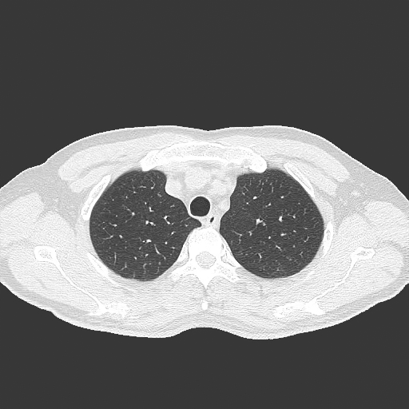
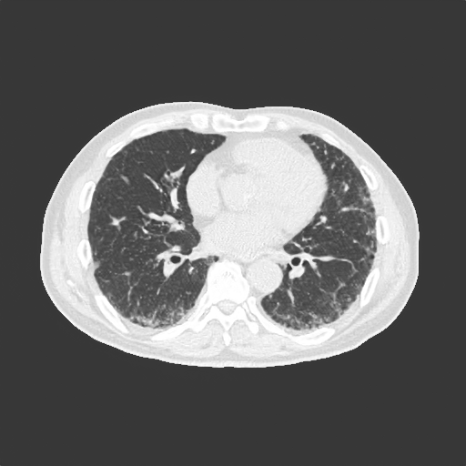

# CT Image Classification Project

## 빠른 시작 (데이터 압축 해제)
- `data/` 폴더에 Normal/Abnormal 관련 원본 압축 파일(`.tar`)을 넣어두세요. 분할된 `.zip.part*` 파일이 함께 있는 경우에도 스크립트가 자동으로 병합·해제합니다.
- 아래 한 줄로 자동으로 압축 해제/병합/정리됩니다.

```bash
bash scripts/extract_all.sh
```

- Windows에서는 Git Bash 또는 WSL에서 위 명령을 실행하세요.
- 완료 후 데이터는 `data/Training/{image,label}`, `data/Validation/{image,label}` 구조로 정리됩니다.

## 데이터 출처
AI Hub - 합성데이터 기반 흉부 CT 영상 데이터  
https://aihub.or.kr/aihubdata/data/view.do?pageIndex=1&currMenu=115&topMenu=100&srchOptnCnd=OPTNCND001&searchKeyword=%ED%95%A9%EC%84%B1%EB%8D%B0%EC%9D%B4%ED%84%B0&srchDetailCnd=DETAILCND001&srchOrder=ORDER001&srchPagePer=20&srchDataRealmCode=REALM006&aihubDataSe=data&dataSetSn=71597


## 데이터 구조
바이너리 분류 기준(Normal vs 선택한 1개 Abnormal)으로, 이미지 폴더는 클래스 하위 폴더 없이 평평한(flat) 구조입니다.
압축 해제가 완료되면 다음과 같은 구조로 데이터가 구성됩니다:
```
data/
├── Training/
│   ├── image/                        # PNG 파일이 바로 위치 (Normal + 선택 Abnormal 혼합)
│   │   ├── ChestCT_Normal_*.png
│   │   └── ChestCT_<Selected>_*.png  # 예: Pneumonia, ILD, Lung_Cancer, Pneumothorax 중 1개
│   └── label/                        # JSON 라벨 파일이 바로 위치
│       ├── ChestCT_Normal_*.json
│       └── ChestCT_<Selected>_*.json # 예: Pneumonia, ILD, Lung_Cancer, Pneumothorax 중 1개
└── Validation/
      ├── image/
   │   └── ChestCT_*.png           # Normal + 선택 Abnormal 혼합 이미지
      └── label/
      └── ChestCT_*.json          # 라벨 파일
```

## 데이터 설명

### 이미지 데이터
- **형식**: PNG
- **내용**: 흉부 CT 스캔 이미지
- **Training 세트**: 
   - Normal: 4,000장
   - Pneumonia: 1,000장
   - ILD: 1,000장
   - Lung_Cancer: 1,000장
   - Pneumothorax: 1,000장
   - 총합은 선택한 질병 수에 따라 달라집니다 (예: Normal + Pneumonia만 사용 시 5,000장)
- **Validation 세트**: 
   - Normal + 각 질병 혼합 (수량은 제공본에 따라 상이)

### 라벨 데이터
각 이미지에 대응하는 JSON 파일로 제공되며, 다음 정보를 포함합니다:

```json
{
   "filepath": "원본 데이터 경로",
   "filename": "ChestCT_Normal_00000001.png",
   "label": "Normal",  // 또는 "pneumonia", "ILD", "Lung_Cancer", "pneumothorax"
   "labels": ["Normal", "ILD", "Lung_Cancer", "pneumonia", "pneumothorax"]
}
```

- **filepath**: 원본 데이터셋에서의 파일 경로
- **filename**: 이미지 파일명
- **label**: 해당 이미지의 실제 레이블 (Normal 또는 pneumonia)
- **labels**: 전체 데이터셋에서 사용 가능한 레이블 목록

## 전처리 (Preprocessing)
본 프로젝트는 `src/preprocess.py`의 `get_transforms(image_size=224)`를 사용합니다. 핵심 사항은 다음과 같습니다.

- 입력 크기: 모든 이미지 `224x224`로 리사이즈
- 학습(Train) 변환:
   - RandomHorizontalFlip(p=0.5)
   - RandomRotation(±10°)
   - ColorJitter(brightness=0.2, contrast=0.2)
   - ToTensor()
   - Normalize(mean=[0.485, 0.456, 0.406], std=[0.229, 0.224, 0.225])
- 검증(Validation) 변환:
   - Resize(224x224) → ToTensor() → 동일 Normalize

참고: Normalize는 일반적인 ImageNet 통계를 사용합니다.

## 모델 (Model)
모델은 `src/model.py`의 `build_resnet18_scratch()`를 사용한 ResNet-18 스타일 백본에 MLP 헤드를 결합한 구조입니다.

- 백본: ResNet-18 스타일(블록 구성 [2,2,2,2]), From Scratch 초기화
- 입력 채널: 3채널(PNG)
- 분류 헤드(MLP): hidden `[256]`, `dropout=0.2`
- 출력 클래스: 2 (바이너리 분류: Normal vs 선택 Abnormal)

학습 기본 설정(노트북 예시 기준):
- 손실 함수: CrossEntropyLoss
- 옵티마이저: Adam(lr=1e-4, weight_decay=1e-4)
- 스케줄러: StepLR(step_size=5, gamma=0.1)

## 모델 학습 결과 (최대 10 Epoch)
각 Task에 대해 10 epoch 학습을 수행했으며, 다음은 검증(Validation) 기준의 최고 성능입니다.

| Task | Best AUROC | Best Accuracy (%) | Best F1 |
|------|------------|-------------------|---------|
| Pneumonia | 1.0000   | 99.68 | 0.9919 |
| ILD | 1.0000   | 100.00 | 1.0000 |
| Lung_Cancer | 0.9998   | 99.84 | 0.9960 |
| Pneumothorax | 0.9987   | 98.88 | 0.9717 |

## 결과 분석 및 결론
검증 지표(AUROC/Accuracy/F1)가 전반적으로 매우 높게 수렴하는 현상이 관측되었습니다. 실제 `data/` 내 예시를 보면 Normal과 ILD 간 해상도(선명도·디테일) 차이가 있어, 모델이 병변 특징 대신 해상도 차이를 단서로 학습하는 “shortcut learning” 가능성이 큽니다.

예시 이미지 (원본 데이터에서 1장씩 발췌):

| Normal (예시) | ILD (예시) |
|---|---|
|  |  |

위와 같은 경우, 단순 리사이즈(224×224)만으로는 원천 해상도/샤프니스 차이가 잔존할 수 있어 모델이 비본질적 신호에 의존할 수 있습니다.

- 관찰: Normal 이미지가 상대적으로 더 높은 해상도·선명도를 보이고, ILD는 상대적으로 낮은 경향 → 지표가 1.0에 수렴
- 결론: 현재 세팅에서는 모델이 병변 패턴보다 해상도 차이를 학습했을 확률이 높음

## 프로젝트 출처
본 프로젝트는 분당서울대학교병원(SNUBH) Health Data Insights Lab 인턴 활동을 진행하면서 과제로 수행한 프로젝트입니다.


